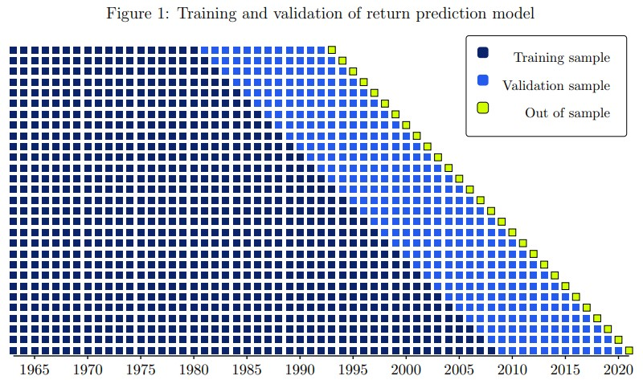
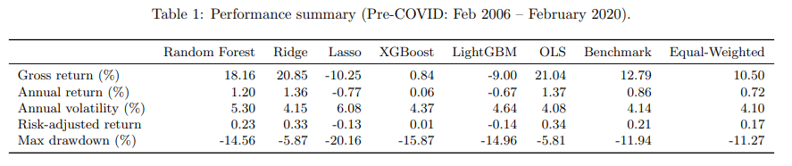
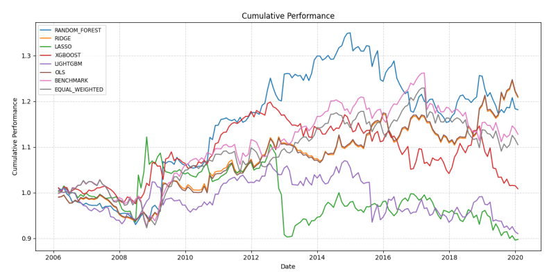

# Predicting Analyst Performance — A Machine Learning Fund-of-Analysts Framework

---

## Abstract

>Inspired by Alpha in Analysts (2025), we study the investment value of sell-side analyst price targets
by treating each analyst as a portfolio manager and constructing long--short portfolios based on implied 12-month returns.
Using a large panel of analyst-level portfolio returns, we predict one-month-ahead analyst performance in an expanding walk-forward framework.
We compare linear models with modern machine learning methods, including tree-based ensembles and neural networks.
While out-of-sample RMSE differences are modest across models, non-linear methods substantially outperform linear benchmarks
in terms of Information Coefficient, indicating a superior ability to rank analysts by future performance.
However, realized portfolio returns remain highly regime-dependent, highlighting the gap between predictive ranking power and investable alpha.

---

## Data

This project relies on two core datasets get through Wharton Research Data Services (WRDS):

- **Target prices / recommendations (I/B/E/S data)**  
  Minimum required fields:
  - `reco_date` (date of the recommendation / target price)
  - `analyst_id` (unique analyst identifier)
  - `stock_id` (unique stock identifier, consistent with the prices table)
  - `target_price` (numeric)
  - *(optional but useful)* `currency`, `broker_id`, `horizon`, etc.

- **Daily prices (CRSP data)**  
  Minimum required fields:
  - `date`
  - `stock_id`
  - `price` (close or adjusted close)

Additional datasets may be used for features (analyst characteristics, broker information, 
stock fundamentals).

---

## Framework methodology

### 1) From target prices to implied returns

For analyst $i$, stock $k$, at month-end $t$, we compute the implied 12-month return forecast:

$$
r^{\mathrm{imp}}_{i,k,t}=\frac{TP_{i,k,t}}{P_{k,t}}-1.
$$

We then build a **self-financing long–short portfolio** per analyst by splitting the coverage universe into positive and negative buckets:

$$
\mathcal{K}^{+}_{i,t}=
\{k:\widehat{R}^{\,t+12}_{i,k}>0\}
\quad\
\mathcal{K}^{-}_{i,t}=
\{k:\widehat{R}^{\,t+12}_{i,k}<0\}
$$

and defining bucket-normalized weights:

$$
w^{+}_{i,k,t}=
\frac{\widehat{R}^{\,t+12}_{i,k}}{\sum_{j\in\mathcal{K}^{+}_{i,t}}\widehat{R}^{\,t+12}_{i,j}},
\qquad
w^{-}_{i,k,t}=
\frac{-\widehat{R}^{\,t+12}_{i,k}}{\sum_{j\in\mathcal{K}^{-}_{i,t}}-\widehat{R}^{\,t+12}_{i,j}}.
$$

This yields an implied tradable book $\mathbf{w}_{i,t}$ per analyst.

> Interpretation: each analyst book is a sub-portfolio we can aggregate later.

### 2) Learn analyst performance from features

At each rebalancing month $m$, we compute analyst features $A_i^m$ from rolling windows (6M / 12M) and cross-sectional percentiles, then learn a mapping to future analyst performance:

$$\mathrm{PnL}^{m+12}_i = g\left(A_i^m \mid \mathcal{F}_m\right).$$

This is the supervised ML dataset: one row per (analyst, month), features at time $m$, target = forward analyst portfolio performance.

### 3) Fund-of-analysts aggregation

Given predicted forward performance $\widehat{\mathrm{PnL}}^{m+12}_i$, we allocate across analysts:

$$\mathcal{I}_m^{+}={\{i:\widehat{\mathrm{PnL}}^{m+12}_i>0\}},
\qquad
\mathcal{I}_m^{-}={\{i:\widehat{\mathrm{PnL}}^{m+12}_i<0\}}.$$

Long/short meta-weights:

$$c^{+}_{i,m}=\frac{\widehat{\mathrm{PnL}}^{m+12}_i}{\sum_{j\in \mathcal{I}_m^{+}}\widehat{\mathrm{PnL}}^{m+12}_j},\qquad
c^{-}_{i,m}=\frac{-\widehat{\mathrm{PnL}}^{m+12}_i}{\sum_{j\in \mathcal{I}_m^{-}}-\widehat{\mathrm{PnL}}^{m+12}_j}.$$


The final meta-portfolio is an aggregation of analyst books weighted by $c^{+/-}$.

### 4) Machine Learning Training

To preserve the chronological structure of the panel and avoid look-ahead bias, we train all models using a walk-forward cross-validation scheme.
At each rebalancing date $t$, we estimate the model on an expanding training window and evaluate it on the next out-of-sample period (typically one month),
producing strictly out-of-sample predictions for each analyst.

Hyperparameters are selected via a grid search performed within each walk-forward step: for each candidate configuration $\theta$, the model is fit on the training slice
and scored on the corresponding validation slice using ranking-based metrics (primarily the Information Coefficient, i.e., Spearman correlation between predicted and realized forward analyst P\&L),
complemented by point-forecast accuracy measures (e.g., RMSE).
The chosen hyperparameters $\theta^{\star}_t$ are then used to refit the model on the full training data up to $t$ and generate predictions for the next out-of-sample date. 

This procedure yields a time series of out-of-sample forecasts that can be directly fed into the portfolio construction layer.

An example of expanding walk-forward training schedule with cross-validation:


---

## Main Results

Overall, our empirical findings suggest that analyst-level machine learning signals contain meaningful cross-sectional information, as reflected by positive out-of-sample ranking metrics (IC) for several models.

Mean IC by model over the full out-of-sample period:


However, this predictive quality does not systematically translate into superior investment performance once embedded into the meta-portfolio construction,
highlighting a non-trivial gap between forecasting and trading.

Strategy outcomes are strongly regime-dependent: tree-based methods can dominate over sub-periods (notably in the early years) but exhibit sharp deterioration later,
whereas simple linear specifications (OLS/Ridge) appear more stable and deliver the smoothest risk profile, with limited drawdowns and low realized volatility in our runs.



Cumulative performance on the same out-of-sample period:




Finally, these results emphasize that, beyond model selection, robust feature engineering, careful exposure management, and rigorous implementation are critical to turning analyst signals into reliable, investable alpha.

---

## References

- Cartea, A., & Jin, Q. (2025). *Alpha in Analysts*.
- Esakia, M., & Goltz, F. (2025). *What Drives the Performance of Machine Learning Factor Strategies?*

---

## Quickstart

> This repo is `uv`-friendly !

```bash
# 1) Create venv
uv venv .venv
.venv\Scripts\activate

# 2) Install dependencies
uv sync

# 3) Run
uv run python main.py
